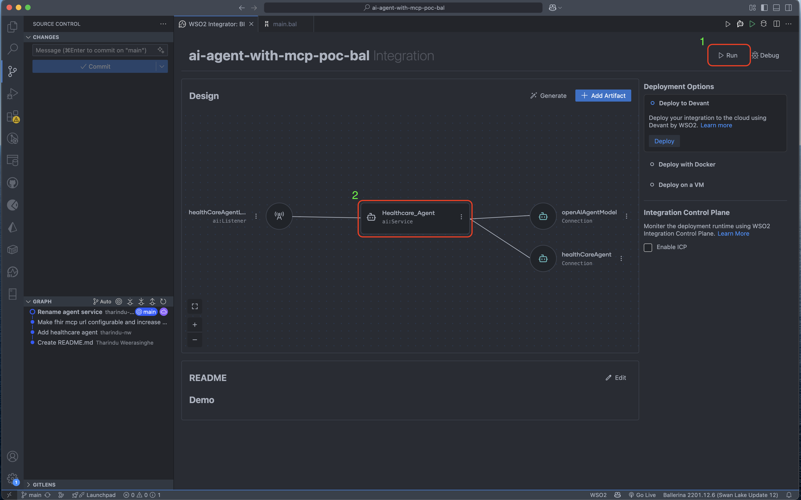
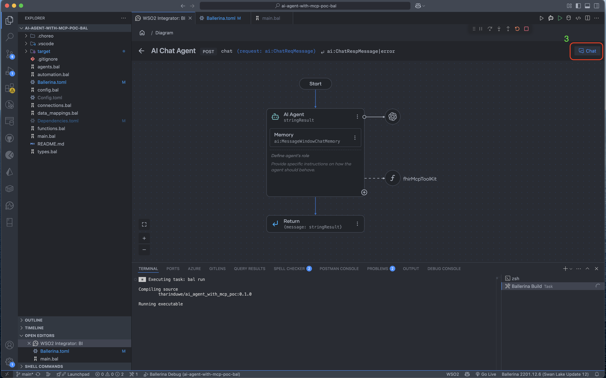
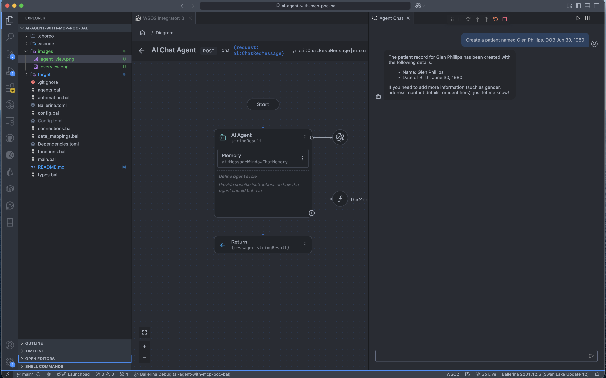

# AI Agent with MCP with Ballerina - Setup Instructions

## Getting Started

### 1. Clone the repository

```bash
git clone git@github.com:tharindu-nw/ai-agent-with-mcp-poc-bal.git
cd ai-agent-with-mcp-poc-bal
```

### 2. Create configuration file

Create a `Config.toml` file in the project directory with the following content:

```toml
openAiApiKey = "your_open_ai_key"
fhirMcpUrl = "fhir_mcp_server_url"
```

### 3. Run the application

1. Open the Ballerina Integrator View
2. Click **Run**
3. Once the service is started, navigate to the Healthcare Agent



### 4. Start chatting

1. Inside the agent view, click **Chat** to communicate with the agent
2. You can try various prompts in the chat window



## Usage

The agent is now ready to respond to your queries and demonstrate the MCP (Model Context Protocol) capabilities.


